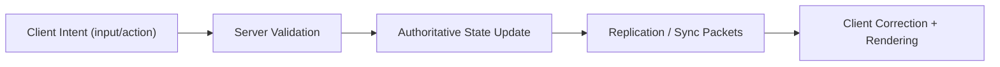

# Grave Below

**Authoritative multiplayer voxel game with physics-first gameplay, configurable spell wards, and evolving region states (Mana / Instability / Decay).**

`Grave Below` is a deep pre-alpha R&D game project focused on hard problems: deterministic-ish simulation, strict server authority, low-level runtime control, and systems that still feel expressive for players.

---

## Table of Contents

1. [What This Project Is](#what-this-project-is)
2. [Current Playable Scope](#current-playable-scope)
3. [Core Gameplay Loop](#core-gameplay-loop)
4. [Feature Overview](#feature-overview)
5. [Server-Authoritative Design](#server-authoritative-design)
6. [Inventory, Items, Wards, Spells](#inventory-items-wards-spells)
7. [Combat and Interaction Rules](#combat-and-interaction-rules)
8. [World Simulation](#world-simulation)
9. [Region System (Mana / Instability / Decay)](#region-system-mana--instability--decay)
10. [Rendering, UI, and UX](#rendering-ui-and-ux)
11. [Controls](#controls)
12. [Chat and Commands](#chat-and-commands)
13. [Build and Run](#build-and-run)
14. [Server Reliability and Chaos Testing](#server-reliability-and-chaos-testing)
15. [Project Structure](#project-structure)
16. [Data and Persistence](#data-and-persistence)
17. [Performance Philosophy](#performance-philosophy)
18. [Known Limits (Pre-Alpha Reality)](#known-limits-pre-alpha-reality)
19. [Roadmap Direction](#roadmap-direction)
20. [Contributing](#contributing)
21. [License](#license)

---

## What This Project Is

`Grave Below` is built around five non-negotiable principles:

- **Server authority first** (no trust in client gameplay state).
- **Simulation over scripted illusion** where possible.
- **Bounded memory + practical runtime safety**.
- **Fast iteration on low-level systems** (network, ECS, rendering, serialization).
- **Gameplay depth through configurable systems** (wards, spell slots, region dynamics), not only static content.

This is not a polished commercial release yet. It is an actively developed, highly technical gameplay sandbox where core architecture is already substantial.

---

## Current Playable Scope

What you can do right now:

- Host or join multiplayer sessions with a dedicated authoritative server.
- Move, build, break blocks (with tool/spell constraints), and explore chunk-streamed worlds.
- Manage quick slots + categorized inventories + ward configuration UI.
- Cast multiple server-authoritative spells.
- Use melee interactions (including knockback logic).
- See and interact with dropped item actors in world space.
- Use command chat with autocomplete, contextual argument hints, and help UI.
- Observe region state effects and debug overlays/tools.

---

## Core Gameplay Loop

1. Enter the world (singleplayer host or multiplayer server).
2. Gather resources and shape terrain through validated edit actions.
3. Manage inventory categories and quick-slot loadout.
4. Equip a ward and configure spell slots.
5. Fight, traverse, and manipulate world state with tools + spells.
6. React to local region conditions (mana/instability/decay) and survival pressure.
7. Repeat with stronger routing between combat, utility magic, and environment systems.

---

## Feature Overview

### Networking and multiplayer

- Custom UDP runtime with reliable/unreliable channels.
- Session lifecycle and handshake flow.
- Player roster with latency quality.
- Authoritative corrections and regular sync flows.

### Survival and modes

- Survival gameplay HUD.
- Authoritative god mode toggle (`/godmode`).
- Separate noclip authority (`/noclip`).
- Hunger/HP gameplay states integrated into runtime.

### Movement and stance systems

- Walk/sprint/jump behavior.
- Sneak (`Shift`) with synced stance.
- Crawl gating via `Z` (sneak-context crawling).
- Player animation state hooks for still/walk/run/eat and stance overlays.

### Inventory and UX

- 9-slot quick bar.
- Multiple category inventories (27 slots each).
- Drag/drop interactions and slot operations.
- Trash slot behavior.
- Ward configuration panel integrated with inventory flow.

### Spells and wards

- Wards as configurable spell containers.
- Spell slot editing.
- Runtime cast/reload model.
- Server-authoritative spell execution.

### Region gameplay substrate

- Region state persisted on server.
- Mana/Instability/Decay state model.
- Diffusion updates (mana and decay).
- Active-region sync to clients.

### World actors and drops

- Dropped items rendered and simulated as actors.
- On-ground behavior and pickup flow.
- Item merge/stack logic where applicable.
- Dedicated caps and simulation-oriented constraints.

---

## Server-Authoritative Design

The client sends **intent**, not final truth.

### Server validates:

- movement packets and constraints,
- block edits and edit permissions,
- combat/miss/hit/knockback,
- inventory operations,
- ward config operations,
- spell cast legality + runtime state transitions,
- actor lifecycle updates.

### High-level pipeline



This architecture is used across edits, inventory, spells, and combat.

---

## Inventory, Items, Wards, Spells

## Inventory model

- **Quick slots:** 9
- **Category inventories:** 27 slots each
- **Cursor slot:** transient item handling
- **Trash slot:** explicit disposal UX

## Item model

Items are centrally defined with:

- category,
- stack policy,
- max stack,
- texture/atlas mapping,
- optional decay behavior,
- gameplay flags.

### Categories in use

- Blocks
- Consumables
- Materials
- Spelling Wards
- Spells

## Decay/freshness systems

Consumables track freshness and can degrade. Freshness data is intended to remain server-authoritative through inventory movement and stacking flows.

## Wards

A ward is treated as a configurable magic container:

- slot capacity,
- stat profile (cast delay, reload delay, spread, speed),
- spell slot occupancy.

Ward configuration is exposed in a dedicated UI subpanel and applied through authoritative state changes.

## Implemented spell set (authoritative)

1. **Bolt** - straight projectile damage.
2. **Dig** - terrain utility damage/break interaction.
3. **Burst** - multi-projectile cone cast.
4. **Beam** - continuous ray-style damage.
5. **Orb** - slower projectile/hazard style.
6. **Mine** - placeable trap behavior.
7. **Shield Pulse** - short-range utility pulse.
8. **Mark** - world mark utility.
9. **Pull** - force-based pull utility.
10. **Blink Step** - short mobility shift.

---

## Combat and Interaction Rules

Current combat direction:

- melee + spell hybrid gameplay,
- server-side hit authority,
- knockback integration,
- item-dependent interaction behavior (for example, tool type and block hardness constraints),
- explicit separation between survival constraints and god mode behavior.

The game intentionally treats combat as simulation/gameplay logic first, then visuals, then polish.

---

## World Simulation

### Chunks and streaming

- Voxel world segmented by chunk.
- Server controls chunk relevance and stream flow.
- Client builds chunk meshes via job-based pipeline.

### Block interaction and break feedback

- Breaking pipeline includes crack-stage visuals.
- Block profiles can define hardness and related behavior.
- Authoritative edits remain final source of truth.

### Fluids

- Multi-fluid simulation support exists (water, blood, slime in current development scope).
- Density-aware ordering and transfer behavior.
- Bounded update loops and safety checks to avoid runaway workloads.

### Trees and falling behavior

- Tree detection and controlled falling simulation exist in runtime.
- Break events can trigger larger tree-part simulation depending on classification and limits.
- Block-to-drop conversion is integrated with world actor flow.

### Item drops

- World drops are actors, not just UI counters.
- Grounded simulation and pickup logic.
- Merge behavior for compatible stacks.
- Lifetime/cleanup constraints and persistence paths.

---

## Region System (Mana / Instability / Decay)

Regions are **not chunks**.
They are long-lived world state containers identified by deterministic spatial partitioning.

## Region identity

- Voronoi-style horizontal partitioning (`XZ`).
- Vertical band partitioning (`Y`) for depth/height-aware region IDs.

## Region state

Per region, server tracks (minimum set):

- `mana`
- `instability`
- `decay`
- neighbor list/cache
- dirty flags
- update ticks

## Diffusion model

- Mana diffusion: enabled, relatively permissive.
- Decay diffusion: slower and more conservative.
- Instability diffusion: local (no direct bleed by default).

## Why this matters

This enables environment-level gameplay without binding everything to chunk-local logic:

- sky/perception hooks,
- spell behavior hooks,
- long memory of world stress,
- future ritual and grave interactions.

---

## Rendering, UI, and UX

### Rendering highlights

- Terrain/world pass.
- Entity and world actor rendering.
- Fluid pass with weighted blending flow.
- Post processing hooks (HP/death tint and contextual overlays).

### UI layers

- Main menu and settings flows.
- In-game inventory, chat, and help windows.
- Command suggestions and argument descriptions.
- Separate player-facing and developer-facing HUD modes.

### Developer tooling in-client

- F2 debug information.
- Region border line rendering in debug mode.
- Runtime counters and diagnostics overlays.

---

## Controls

Defaults are rebindable via settings.

- Move: `W A S D`
- Up / Down: `E` / `Q`
- Sprint: `Ctrl`
- Sneak: `Shift`
- Crawl (while sneak context): `Z`
- Quick slots: `1..9`
- Inventory: `I`
- Chat open: `Enter` or `/`
- Suggestion selection action: `Left` / `Right`
- Cursor toggle: `F1`
- Dev HUD: `F2`
- Godmode quick action: `F3`
- Player HUD: `F10`
- Fullscreen: `F11`
- VSync: `F12`
- Wireframe: `F9`
- Menu/back: `Esc`

---

## Chat and Commands

Core command set:

- `/help`
- `/give @nickname item_name`
- `/pos`
- `/tp x y z`
- `/setblock x y z block_name`
- `/watersource ...`
- `/settime ...`
- `/godmode`
- `/noclip`

Region/debug commands:

- `/region`
- `/regionneighbors`
- `/regionset mana|instability|decay delta`
- `/regionrepair`
- `/regionstep [count]`

Command UX supports:

- autocomplete,
- contextual hints,
- argument-aware suggestion lists.

---

## Build and Run

## Requirements

- CMake 3.22+
- Visual Studio 2022 (Windows primary flow)
- OpenGL-capable GPU/driver
- Git (with submodules)

## Clone

```bash
git clone --recurse-submodules <repo-url>
cd grave-below
git submodule update --init --recursive --remote
```

## Windows presets

Configure:

```bash
cmake --preset win32
```

or

```bash
cmake --preset win64
```

Build (example):

```bash
cmake --build build/win32 --config ReleaseMini --target client server
```

Important configurations include:

- `Debug`
- `Release`
- `ReleaseMini`
- `ReleaseNoConsole`
- `ReleaseMiniNoConsole`

Run binaries:

- `build/ReleaseMini/client.exe`
- `build/ReleaseMini/server.exe`

## Linux presets (Ninja Multi-Config)

- `l` (x64)
- `l32` (x86)

---

## Server Reliability and Chaos Testing

Dedicated stress client target:

- `test_server_chaos_client`

Example:

```bash
build/ReleaseMini/test_server_chaos_client.exe --seconds 120 --chaos-workers 4 --chaos-burst 96 --chaos-sleep-ms 1
```

This test is used to:

- hammer packet paths,
- validate handshake/timeout handling,
- surface lockups and backpressure regressions,
- track runtime counters under hostile or noisy traffic.

---

## Project Structure

```text
src/
  engine/
    core/           # config, resources, key bindings, utility, model helpers
    voxel/          # block/chunk/world data, mesh paths
    worldgen/       # simplex-based world generation
  game/
    shared/         # protocol, shared gameplay structs, items, regions
    server/         # authoritative runtime, simulation, command handlers, tests
    client/         # render passes, UI/HUD, input, networking, prediction
resources/
  shaders/          # rendering and post effects
  textures/         # block/item/entity textures
  models/           # entity models (including player model)
  world/            # runtime persistence output (regions/chunks/etc.)
```

---

## Data and Persistence

Examples of runtime data/config files:

- `resources/config.bin` - client config.
- `resources/key_bindings.bin` - keybind persistence.
- `resources/server_list.bin` - multiplayer server entries.
- `resources/build.yaml` - block profile metadata (hardness/transparency/build rules).
- `resources/world/regions.bin` - persisted region states.
- additional world/chunk persistence files under `resources/world/`.

---

## Performance Philosophy

This project prefers explicit constraints over accidental complexity:

- bounded queues and actor caps,
- simulation passes with budget awareness,
- constrained serialization targets,
- targeted debug counters for hotspot diagnosis,
- minimizing hidden allocations on critical paths.

The project actively supports constrained/runtime-sensitive configurations, including mini release profiles.

---

## Known Limits (Pre-Alpha Reality)

- Not content-complete.
- Balancing is intentionally rough while systems are still moving.
- Some features are present but still being tuned for edge cases.
- Save compatibility can break across heavy iteration phases.
- Visual polish and VFX/audio pass are not final.

---

## Roadmap Direction

Near-term and medium-term direction:

- deeper staff/ward gameplay economy,
- stronger mana-linked casting consequences,
- expanded entity ecosystem and PvE pressure,
- richer region-driven atmosphere/perception,
- better AI/mob loops,
- stronger stress-tested server reliability guarantees,
- broader content for caves, structures, progression, and biomes.

---

## Contributing

Contributions are welcome.

Recommended PR style:

- one clear problem per PR,
- include reproduction steps for bugfixes,
- include tested configs,
- describe gameplay + networking implications,
- preserve authoritative model and bounded-memory practices.

When adding gameplay systems, document:

- client prediction behavior,
- authoritative validation logic,
- persistence implications,
- rollback/correction behavior.

---

## License

See [LICENSE](LICENSE).

Third-party licenses and components live under `3rd_party/`.

---

## Quick Pitch (for players/devs)

`Grave Below` is a physics-first, server-authoritative voxel sandbox where world-state systems (not just graphics) drive gameplay: configurable wards, real spell runtime logic, survival pressure, region ecology, and a deeply instrumented multiplayer backend built to survive edge cases.
